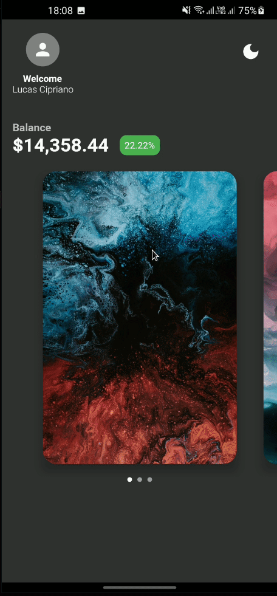

# Switch theme example

Estudo do Flutter para compreender como se comporta a alteração do tema inteiro do aplicativo.

## EDIT!

O projeto ficou um pouco maior do que o esperado, adicionei algumas coisas como PageView e afins para ter um estudo do Flutter completo. Existe código duplicado, minha intenção não é fazer o melhor aqui, sim apenas experimentar o que o Framework oferece.

## EDIT2

O código está uma bagunça de propósito, minha intenção era finalizar o Aplicativo em um dia, comecei a trabalhar nele as 6h da manhã e finalizei ás 18h.

